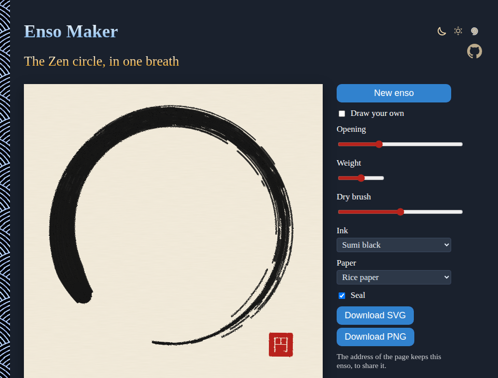

# Enso-Maker

The Zen circle, painted in one breath: generate an ensō as a brush painting, with the dry-brush streaks where the ink runs out, on rice paper with a red seal, or draw your own. Download it as SVG or PNG. No sign-up and no libraries.

- [Make an enso](https://evoluteur.github.io/enso-maker/)

## What it does

- **New enso**: a new circle, different every time, from a seed kept in the address so it can be shared.
- **Opening**: from a closed circle (the brush overlapping its start) to a wide gap.
- **Weight** and **Dry brush**: how heavy the stroke is, and how soon the brush runs dry.
- **Ink** (sumi black, indigo, vermilion, gold), **paper** (rice paper, white, or transparent) and the **seal**, a red hanko reading 円, "circle".
- **Draw your own**: paint the circle yourself with the mouse or a finger; slow strokes are heavier, fast ones lighter.
- **Download** as SVG (vector, for print or a laser cutter) or PNG (1200 × 1200).

## How it is built

The stroke is drawn as a bundle of 46 bristles following one path. Each bristle carries its own ink, which runs out along the stroke at its own pace (the edges of the brush first), so the end of the circle breaks into dry-brush streaks, the *kasure* of Japanese calligraphy. An SVG filter roughens the edges like ink bleeding into paper.

Plain HTML, CSS and JavaScript, with no dependencies and no build step. Just open `index.html`. The three color themes (dark, light and blue) are shared with my other projects (copied from [omg-themes](https://github.com/evoluteur/omg-themes)).

Enso-Maker is open source at [GitHub](https://github.com/evoluteur/enso-maker) with MIT license.

Had fun browsing the app? [Buy me a coffee by becoming a sponsor](https://github.com/sponsors/evoluteur).

You may also be interested in my other projects [Zen-Garden](https://github.com/evoluteur/zen-garden) ([demo](https://evoluteur.github.io/zen-garden/)), [Mandala-Maker](https://github.com/evoluteur/mandala-maker) ([demo](https://evoluteur.github.io/mandala-maker/)) and [Sacred-Geometry](https://github.com/evoluteur/sacred-geometry) ([demo](https://evoluteur.github.io/sacred-geometry/)). For more mystic arts as small web apps, see [Esoterica](https://evoluteur.github.io/esoterica.html).

Copyright (c) 2026 [Olivier Giulieri](https://evoluteur.github.io/).
